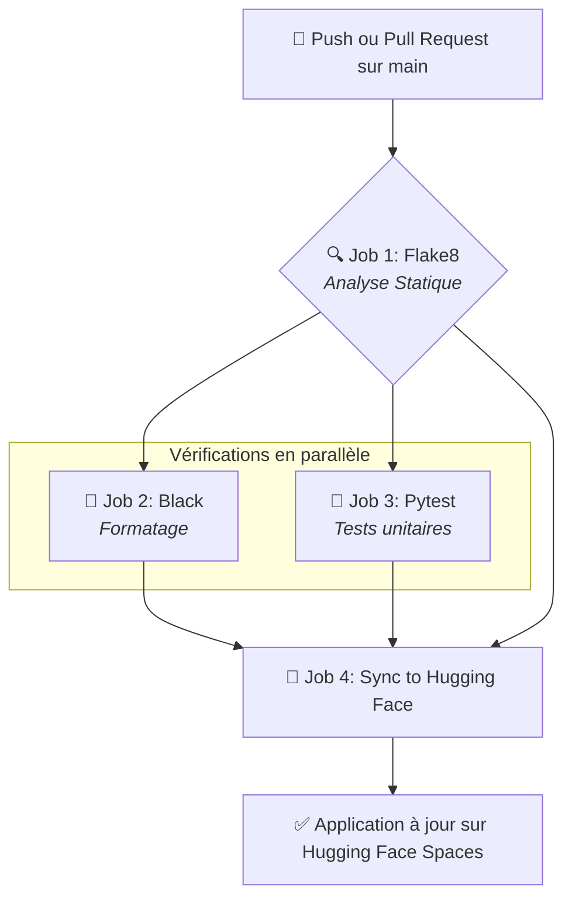
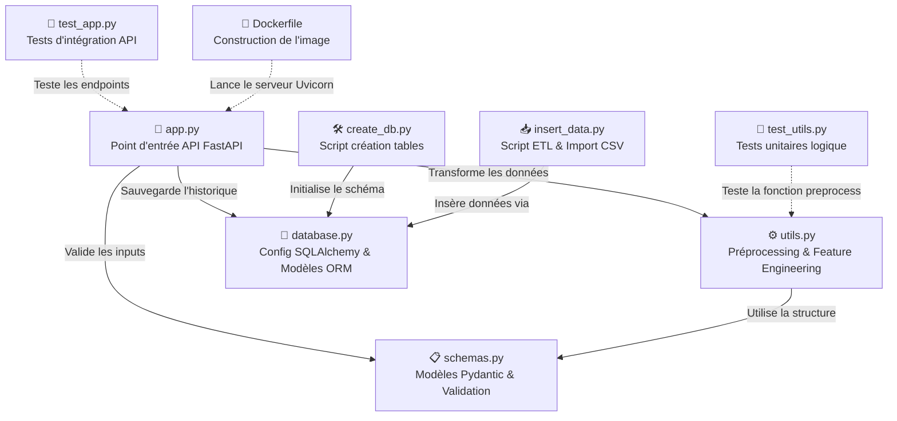

<a id="readme-top"></a>

[](https://www.python.org/)
[](https://fastapi.tiangolo.com/)
[](https://www.postgresql.org/)
[](https://www.docker.com/)
[](https://github.com/features/actions)
[](https://huggingface.co/spaces)

<br />
<div align="center">
  <h2 align="center">🚀 FUTURISYS — Prédiction de l'Attrition Employé</h2>
  <p align="center">
    Une solution MLOps complète pour anticiper les départs et fidéliser les talents.
    <br />
    <a href="#demo"><strong>Explorer la démo »</strong></a>
    <br />
    <br />
    <a href="#api">Documentation API</a>
    ·
    <a href="#bugs">Signaler un Bug</a>
  </p>
</div>

<details>
  <summary>Table des matières</summary>
  <ol>
    <li><a href="#-présentation-du-projet">Présentation du Projet</a></li>
    <li><a href="#-le-modèle-dia">Le Modèle d'IA</a></li>
    <li><a href="#-architecture-technique">Architecture Technique</a></li>
    <li><a href="#-guide-dutilisation">Guide d'Utilisation (Cloud & Local)</a></li>
    <li><a href="#-documentation-api">Documentation API</a></li>
    <li><a href="#-qualité--tests">Qualité & Tests</a></li>
    <li><a href="#-roadmap">Roadmap</a></li>
    <li><a href="#contact">Contact</a></li>
  </ol>
</details>

---

## <a id="-présentation-du-projet"></a>📋 Présentation du Projet

Dans le cadre d'une mission stratégique pour **Futurisys**, ce projet vise à fournir à l'entreprise cliente **TechNova Partners** un outil d'aide à la décision pour la gestion des ressources humaines.

L'objectif est double :
1.  **Identifier** les employés à risque de départ (attrition) grâce à l'intelligence artificielle.
2.  **Comprendre** les causes racines grâce à l'analyse des données (salaires, satisfaction, distance domicile-travail, etc.).

L'application est conçue selon les principes **MLOps** modernes : une API robuste, une base de données pour l'historisation, et une chaîne de déploiement continu (CI/CD) vers le cloud.

<p align="right"><a href="#readme-top">⬆️ Revenir au sommaire</a></p>

---

## <a id="-le-modèle-dia"></a>🧠 Le Modèle d'IA

Le cœur de cette solution repose sur un modèle de Machine Learning optimisé pour la production.

* **Algorithme :** Random Forest Classifier (version allégée).
* **Architecture :** Le modèle a été compressé pour garantir une inférence rapide sans sacrifier la précision.
* **Données :** Entraîné sur un jeu de données RH complet, il utilise **17 variables explicatives** (features).
* **Feature Engineering :** Une attention particulière a été portée à la création de données. Sur les 17 features, **5 ont été spécifiquement ingéniérées** pour capturer des signaux complexes (ex: ratio fréquence de déplacement/salaire, impact des heures supplémentaires).

### Performances
Le modèle atteint des métriques solides sur le jeu de test :
* **Rappel (métrique la plus importante pour ce projet) :** 83%
* **Précision :** 0.35

<p align="right"><a href="#readme-top">⬆️ Revenir au sommaire</a></p>

---

## <a id="-architecture-technique"></a>🏗 Architecture Technique

L'infrastructure repose sur une séparation claire des responsabilités :

### Pipeline CI/CD

L'automatisation est gérée via GitHub Actions pour assurer la qualité du code et le déploiement continu.



### Stack Technologique

La liste des outils utilisés dans ce projet est la suivante :

| Technologie | Usage |
| ----------- | --- |
| Python 3.12+ | Langage principal |
| FastAPI | Framework API haute performance |
| Scikit-Learn | Modélisation et pipelines ML |
| PostgreSQL | Base de données relationnelle (Persistance) |
| Docker | Conteneurisation de l'application |
| GitHub Actions | CI/CD (Intégration et Déploiement Continus) |
| Hugging Face | Hébergement Cloud (PaaS) |

#### Architecture logique interne



<p align="right"><a href="#readme-top">⬆️ Revenir au sommaire</a></p>

---

## <a id="-guide-dutilisation"></a>🚀 Guide d'Utilisation

Ce projet est conçu pour être flexible. Vous pouvez l'utiliser soit en mode "Démo" sur le cloud, soit en mode "Complet" sur votre machine locale.

### <a id="demo"></a>☁️ Option A : Accès Rapide (Démo Cloud)
Pour tester le modèle immédiatement sans aucune installation technique :

* 🌍 Accéder à l'application : [🔗 [5-deploy-ml](https://huggingface.co/spaces/JonathanFernandez/5-deploy-ml)]
* 📖 Documentation API (Swagger) : Accessible via l'endpoint `/docs` sur l'URL du Space.

⚠️ **Note importante** : Cette version hébergée sur Hugging Face fonctionne en environnement sandbox. Contrairement à la version locale, les prédictions ne sont pas enregistrées dans une base de données persistante.

### 💻 Option B : Installation Locale (Développement)

Pour disposer de toutes les fonctionnalités, y compris l'historisation en base de données PostgreSQL.

#### 1. Prérequis

* Python 3.12+
* PostgreSQL (local ou Docker)
* Git

#### 2. Installation

Cloner le dépôt :

```bash
git clone [https://github.com/Jojo4911/5-deploy-ml.git](https://github.com/ojo4911/5-deploy-ml.git)
cd futurisys-attrition-app
```

Initialiser l'environnement :

Ce projet utilise Poetry pour la gestion des paquets, mais un fichier `requirements.txt` est également fourni.

```
# Via Poetry (Recommandé)
poetry install
```

```
# OU via Pip
pip install -r requirements.txt
```

#### 3. Configuration (.env)

Le projet nécessite une base de données PostgreSQL.

Créez une base de données vide nommée projet5_db (via pgAdmin ou psql).

Renommez le fichier .env.example en .env et configurez vos accès.

#### 4. Lancement

Deux scripts sont à votre disposition pour préparer l'environnement de la base de données :

```
# 1. Créer les tables dans la base de données
poetry run python create_db.py

# 2. Insérer l'historique des données (Dataset HR - 1470 lignes)
poetry run python insert_data.py
```

Pour lancer l’API localement :

```
uvicorn app.main:app --reload
```

* L'API sera accessible sur : `http://localhost:8000`
* La documentation Swagger : `http://localhost:8000/docs`
* La base de données sera initialisée automatiquement.

<p align="right"><a href="#readme-top">⬆️ Revenir au sommaire</a></p>

---

## <a id="-documentation-api"></a>📖 Documentation API

L'API est documentée automatiquement selon le standard OpenAPI.

**Endpoints Principaux**

| Endpoint | Description |
|-----------|--------------|
| `GET/` | Endpoint d’accueil |
| `GET/health` | Vérification de l’état du service |
| `GET/model-info` | Informations du modèle |
| `POST/predict` | Prédiction de l’attition des employés |

* **Input** : JSON contenant 15 caractéristiques socio-professionnelles de l'employé.
* **Output** : Probabilité d'attrition et classe prédite (0 ou 1).

*Persistance* : Sauvegarde automatique des données et du résultat en base (mode Local uniquement).

Exemple de requête (cURL) :

```bash
curl -X 'POST' \
  'https://jonathanfernandez-5-deploy-ml.hf.space/predict' \
  -H 'accept: application/json' \
  -H 'Content-Type: application/json' \
  -d '{
  "frequence_deplacement": "Aucun",
  "revenu_mensuel": 0,
  "heure_supplementaires": "Oui",
  "distance_domicile_travail": 0,
  "satisfaction_employee_environnement": 1,
  "satisfaction_employee_nature_travail": 1,
  "satisfaction_employee_equipe": 1,
  "satisfaction_employee_equilibre_pro_perso": 1,
  "annee_experience_totale": 0,
  "annees_dans_l_entreprise": 0,
  "nombre_participation_pee": 0,
  "age": 0,
  "annes_sous_responsable_actuel": 0,
  "nombre_experiences_precedentes": 0,
  "note_evaluation_precedente": 1
}'
```

Exemple de réponse :

```bash
{
  "prediction": "The employee is likely to stay",
  "probability": 0.4000913531689877,
  "input_processed": [
    [
      0,
      0,
      0,
      0,
      1,
      0,
      0,
      0,
      0,
      1,
      0,
      0,
      0,
      0,
      1,
      1,
      1
    ]
  ]
}
```

<p align="right"><a href="#readme-top">⬆️ Revenir au sommaire</a></p>

---

## 🧪 Qualité & Tests

La robustesse du déploiement est vérifiée par une suite de tests :
* **Tests Unitaires** : Validation du chargement du modèle et des fonctions de prétraitement.
* **Tests Fonctionnels** : Simulation d'appels API avec des cas limites (données manquantes, formats invalides).

Pour lancer les tests en local :

```bash
# Installation des dépendances de test
pip install -r requirements.txt

# Lancer les tests
pytest

# Lancement de la suite avec rapport de couverture
pytest --cov=app --cov-report=term-missing
```

<p align="right"><a href="#readme-top">⬆️ Revenir au sommaire</a></p>

---

## <a id="-roadmap"></a>🗺 Roadmap

* [x] Entraînement et optimisation du modèle Random Forest.
* [x] Création de l'API avec FastAPI.
* [x] Conteneurisation Docker.
* [x] Pipeline CI/CD GitHub Actions.
* [x] Déploiement sur Hugging Face Spaces.
* [ ] Ajout d'un dashboard de monitoring (Streamlit/Grafana).
* [ ] Réentraînement automatique sur les nouvelles données.

<p align="right"><a href="#readme-top">⬆️ Revenir au sommaire</a></p>

---

## <a id="-contact"></a>👤 Auteurs & Licence

Projet 5, réalisé dans le cadre de la formation **IA Engineer - OpenClassrooms**.

Distribué sous la licence MIT.

Contact : Jonathan FERNANDEZ - [Lien LinkedIn ou Email]

<p align="right"><a href="#readme-top">⬆️ Revenir au sommaire</a></p>