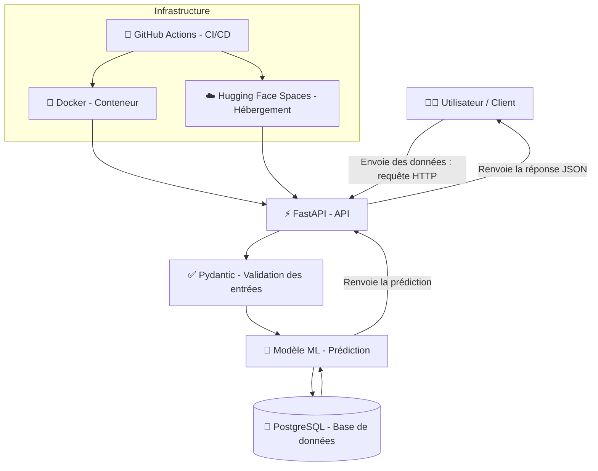
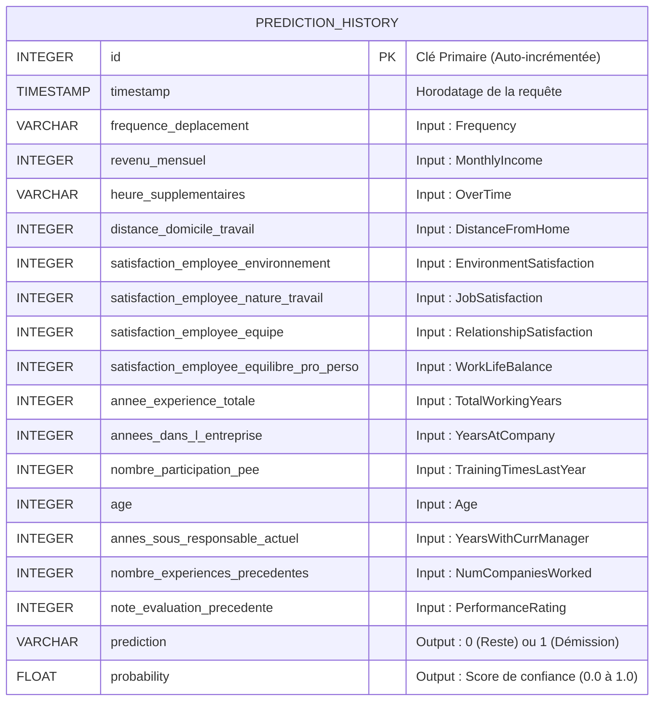
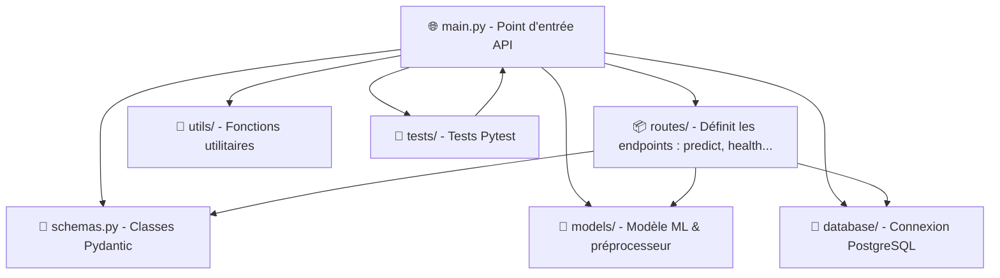
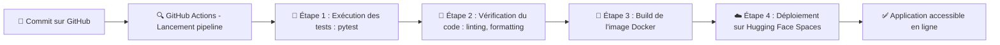

# Futurisys - POC : Prédiction de l'Attrition Employé (TechNova Partners)

## 📋 Présentation du Projet

Dans le cadre d'une mission pour **Futurisys**, ce projet vise à déployer un outil de classification pour l'entreprise TechNova Partners. L'objectif est d'identifier les causes racines derrière les démissions (attrition) afin de proposer des plans d'action ciblés.

Le moteur de prédiction repose sur un modèle **Random Forest allégé**, optimisé pour la production. L'application est hébergée sur Hugging Face Spaces, offrant une interface API robuste et une traçabilité complète des prédictions via une base de données PostgreSQL.

## 🚀 Fonctionnalités

* **API REST** : Développée avec FastAPI pour des performances optimales, rapidité, validation automatique avec Pydantic, documentation Swagger native.
* **Modèle ML** : Classification binaire (Attrition: Oui/Non) via Random Forest.
* **Hébergement Cloud** : Déploiement continu sur Hugging Face Spaces.
* **Persistance PostgreSQL** : Historisation de chaque prédiction (inputs RH et scores d'attrition) pour analyse ultérieure. PostgreSQL a été choisi pour la persistance et l’intégrité des données et la scalabilité.
* **Validation Pydantic** : Contrôle strict de la conformité des données employés envoyées à l'API.
* **Tests & Qualité** : Couverture de tests unitaires et fonctionnels avec Pytest.

### 🛡️ Robustesse et Tolérance aux pannes
L'application implémente une stratégie de **dégradation gracieuse** :
* **En Local** : L'API se connecte à PostgreSQL et archive chaque requête.
* **Sur le Cloud (Hugging Face)** : Si aucune base de données n'est configurée (ou en cas de panne DB), l'API continue de fournir des prédictions en mode "stateless" (sans persistance), garantissant la disponibilité du service.

## 🏗️ Architecture des outils utilisés

L’ensemble des outils utilisés peuvent être représentés selon la vue d’ensemble suivante :


```mermaid
flowchart TD
    A[👩‍💻 Utilisateur / Client] -->|Envoie des données : requête HTTP| B[⚡ FastAPI - API]
    B --> C[✅ Pydantic - Validation des entrées]
    C --> D[🧠 Modèle ML - Prédiction]
    D --> E[(💾 PostgreSQL - Base de données)]
    E --> D
    D -->|Renvoie la prédiction| B
    B -->|Renvoie la réponse JSON| A

    subgraph Infrastructure
        F[🐳 Docker - Conteneur]
        G[☁️ Hugging Face Spaces - Hébergement]
        H[🤖 GitHub Actions - CI/CD]
    end

    F --> B
    H --> F
    H --> G
    G --> B
```

## 💾 Architecture de Données (PostgreSQL)

Afin d'assurer une traçabilité complète et de surveiller le *Data Drift*, nous avons opté pour une architecture "Flat Table". Chaque prédiction (inputs + outputs) est stockée dans une table unique.

Voici le schéma relationnel (Entity-Relationship Diagram) de la table `predictions` :


```mermaid
erDiagram
    PREDICTION_HISTORY {
        INTEGER id PK "Clé Primaire (Auto-incrémentée)"
        TIMESTAMP timestamp "Horodatage de la requête"
        VARCHAR frequence_deplacement "Input : Frequency"
        INTEGER revenu_mensuel "Input : MonthlyIncome"
        VARCHAR heure_supplementaires "Input : OverTime"
        INTEGER distance_domicile_travail "Input : DistanceFromHome"
        INTEGER satisfaction_employee_environnement "Input : EnvironmentSatisfaction"
        INTEGER satisfaction_employee_nature_travail "Input : JobSatisfaction"
        INTEGER satisfaction_employee_equipe "Input : RelationshipSatisfaction"
        INTEGER satisfaction_employee_equilibre_pro_perso "Input : WorkLifeBalance"
        INTEGER annee_experience_totale "Input : TotalWorkingYears"
        INTEGER annees_dans_l_entreprise "Input : YearsAtCompany"
        INTEGER nombre_participation_pee "Input : TrainingTimesLastYear"
        INTEGER age "Input : Age"
        INTEGER annes_sous_responsable_actuel "Input : YearsWithCurrManager"
        INTEGER nombre_experiences_precedentes "Input : NumCompaniesWorked"
        INTEGER note_evaluation_precedente "Input : PerformanceRating"
        VARCHAR prediction "Output : 0 (Reste) ou 1 (Démission)"
        FLOAT probability "Output : Score de confiance (0.0 à 1.0)"
    }
```

## 🛠️ Installation et Configuration

### Prérequis

* Python 3.12+
* PostgreSQL (local ou Docker)
* Git

### Installation locale

1. Cloner le dépôt :

```bash
git clone [https://github.com/Jojo4911/5-deploy-ml.git](https://github.com/ojo4911/5-deploy-ml.git)
cd futurisys-attrition-app
```

2. Initialiser l'environnement :

Ce projet utilise Poetry pour la gestion des paquets, mais un fichier `requirements.txt` est également fourni.

```
# Via Poetry (Recommandé)
poetry install
```

```
# OU via Pip
pip install -r requirements.txt
```

3. Configuration de la Base de Données et des Secrets (.env)

Le projet nécessite une base de données PostgreSQL.

Créez une base de données vide nommée projet5_db (via pgAdmin ou psql).

À la racine du projet, créez un fichier nommé .env.

Copiez-y le contenu suivant en adaptant vos identifiants :

```
# Fichier .env
DB_USER=postgres
DB_PASSWORD=votre_mot_de_passe
DB_HOST=localhost
DB_NAME=projet5_db
```

4. Initialisation des Données

Deux scripts sont à votre disposition pour préparer l'environnement :

```
# 1. Créer les tables dans la base de données
poetry run python create_db.py

# 2. Insérer l'historique des données (Dataset HR - 1470 lignes)
poetry run python insert_data.py
```

## 🌍 Déploiement sur Hugging Face Spaces

L'application est synchronisée automatiquement avec Hugging Face.
* **URL du Space** : https://huggingface.co/spaces/thewayofwisedom/5-deploy-ml
* **Configuration** : Le déploiement utilise un environnement Docker pour garantir la reproductibilité des prédictions.

## 🖥️ Utilisation de l'API

### Architecture logique interne de l’API FastAPI


```mermaid
graph TD
    A[🌐 main.py - Point d'entrée API]
    A --> B[📦 routes/ - Définit les endpoints : predict, health...]
    A --> C[🧩 models/ - Modèle ML & préprocesseur]
    A --> D[🧾 schemas.py - Classes Pydantic]
    A --> E[🧰 utils/ - Fonctions utilitaires]
    A --> F[🧪 tests/ - Tests Pytest]
    A --> G[💾 database/ - Connexion PostgreSQL]

    B --> D
    B --> C
    B --> G
    F --> A
```

### Lancement local

```
uvicorn app.main:app --reload
```

### Exemple de requête (Prédiction d'attrition)

L'API attend 15 caractéristiques socio-professionnelles de l'employé :
```
curl -X 'POST' \
  '[https://votre-space.hf.space/predict](https://votre-space.hf.space/predict)' \
  -H 'X-API-KEY: votre_cle' \
  -H 'Content-Type: application/json' \
  -d '{
  "frequence_deplacement": "Occasionnel",
  "heure_supplementaires": "Non",
  "annees_dans_l_entreprise": 12,
  "nombre_participation_pee": 2,
  "age": 47,
  "revenu_mensuel": 5993,
  "annes_sous_responsable_actuel": 5,
  "distance_domicile_travail": 8,
  "satisfaction_employee_environnement": 2,
  "satisfaction_employee_nature_travail": 4,
  "satisfaction_employee_equipe": 1,
  "satisfaction_employee_equilibre_pro_perso": 3,
  "annee_experience_totale": 8,
  "nombre_experiences_precedentes": 3,
  "note_evaluation_precedente": 3
}'
```

## 📊 Structure des Données (PostgreSQL)

Chaque requête à l'API est enregistrée pour permettre au client TechNova Partners d'auditer les décisions du modèle.

Table `predictions`
* `id` : Identifiant unique.
* `employee_features` : Données envoyées (Age, Salaire, etc.) au format JSONB.
* `attrition_probability` : Score de probabilité calculé par le Random Forest.
* `prediction` : Résultat final (0 ou 1).
* `created_at` : Horodatage de la requête.

## 🧪 Tests et Fiabilité
La robustesse du déploiement est vérifiée par une suite de tests :
* **Tests Unitaires** : Validation du chargement du modèle et des fonctions de prétraitement.
* **Tests Fonctionnels** : Simulation d'appels API avec des cas limites (données manquantes, formats invalides).

```
# Lancer les tests
pytest
# Vérifier la couverture
pytest --cov=app tests/
```

## 🔄 Pipeline CI/CD

La pipeline CI/CD peut être représentée simplement de la manière suivante :


```mermaid
flowchart LR
    A[💾 Commit sur GitHub] --> B[🔍 GitHub Actions - Lancement pipeline]
    B --> C[🧪 Étape 1 : Exécution des tests : pytest]
    C --> D[🐍 Étape 2 : Vérification du code : linting, formatting]
    D --> E[🐳 Étape 3 : Build de l'image Docker]
    E --> F[☁️ Étape 4 : Déploiement sur Hugging Face Spaces]
    F --> G[✅ Application accessible en ligne]

```

Le workflow GitHub Actions assure :

1. La validation du code (Linting & Tests).
2. Le build de l'image Docker.
3. Le push vers le secret `HF_TOKEN` pour mettre à jour le Space Hugging Face en temps réel.

*Livrable réalisé pour le projet d'ingénierie IA - Client : Futurisys / Cas d'étude : TechNova Partners.*